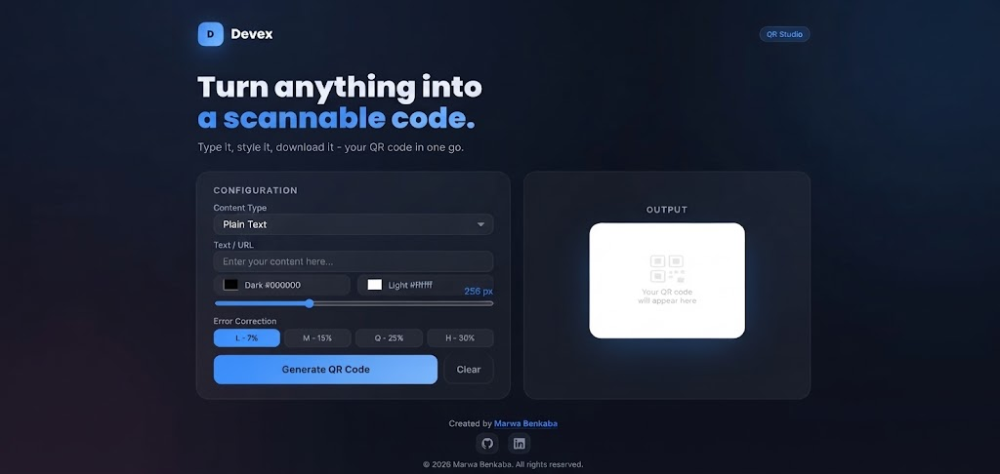

# Devex QR Studio – QR Code Generator

A responsive, browser-based QR code generator developed with **HTML, CSS, and JavaScript**. Devex QR Studio allows users to generate customizable QR codes for different types of content, including URLs, contact information, Wi-Fi credentials, and calendar events. Users can customize the appearance of their QR codes and download them in PNG or SVG format.

## Features

### 1. Multiple QR Code Types

Generate QR codes for:

* Plain text
* URLs and links
* Email addresses
* Phone numbers
* SMS messages
* WhatsApp messages
* Wi-Fi networks
* Contacts (vCard)
* Geographic locations
* Calendar events

### 2. QR Code Customization

* **Foreground and background colors:** Choose custom colors for your QR codes.
* **Adjustable size:** Set the QR code dimensions from 128px to 512px.
* **Error correction:** Choose between four levels:

  * L – 7%
  * M – 15%
  * Q – 25%
  * H – 30%

### 3. Download Options

* Generate QR codes instantly in the browser.
* Download generated QR codes as PNG images.
* Download QR codes in SVG format.

### 4. User Interface

* Modern dark-themed interface.
* Responsive layout for desktop and mobile screens.
* Interactive input fields that adapt to the selected QR code type.
* Live color selection and size adjustment.
* Status messages for generation, downloads, and clearing inputs.
* Simple configuration panel and QR code preview.

## Technologies Used

| Technology   | Purpose                                        |
| ------------ | ---------------------------------------------- |
| HTML5        | Application structure                          |
| CSS3         | Styling, responsive layout, and visual effects |
| JavaScript   | QR generation and interactive functionality    |
| QRCode.js    | QR code generation                             |
| Google Fonts | Poppins and Inter typography                   |

## Project Structure

```text
QR-Generator/
│
├── index.html
└── README.md
```

The project is a standalone web application, with its HTML, CSS, and JavaScript included in a single HTML file.

## Getting Started

### 1. Clone the repository

```bash
git clone https://github.com/USERNAME/devex-qr-studio.git
```

Replace `USERNAME` with your GitHub username.

### 2. Open the project

Navigate to the project folder:

```bash
cd devex-qr-studio
```

Open `index.html` in your browser.

No build process or package installation is required.

**Note:** The application loads QRCode.js and Google Fonts from external CDNs, so an internet connection is required for those resources to load.

## How to Use

1. Open Devex QR Studio in your web browser.
2. Select the type of content you want to encode.
3. Enter the required information.
4. Customize the foreground color, background color, QR size, and error correction level.
5. Click **Generate QR Code**.
6. Preview your generated QR code.
7. Download it in PNG or SVG format.
8. Use **Clear** to reset the form and create another QR code.

## Screenshots

Add screenshots of your application to showcase the interface and its features.

```markdown


```

## Live Demo

Add your deployed application URL here once it is hosted.

## Developer

**Created by Marwa Benkaba**

* GitHub: [BenkabaMarwa](https://github.com/BenkabaMarwa)
* LinkedIn: [Marwa Benkaba](https://www.linkedin.com/in/marwa-benkaba-916090329/)

## License

Add your preferred license before publishing the project. If you want others to use, modify, and redistribute the source code, choose an appropriate open-source license.
